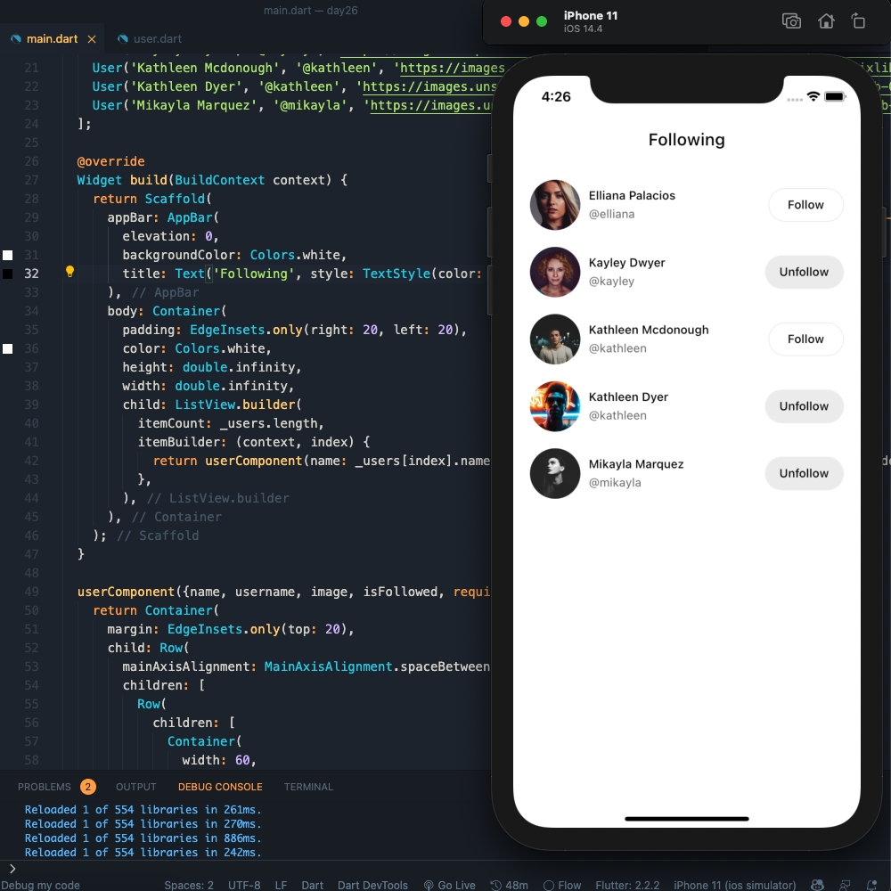
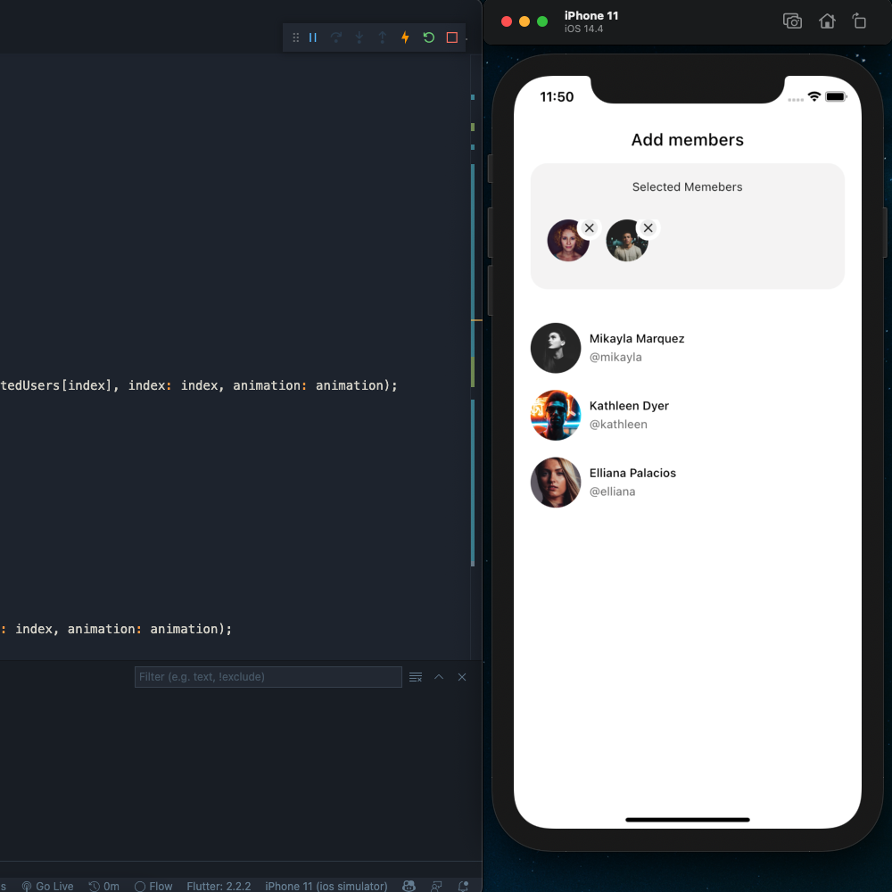

## Flutter Instagram Following List 
## Development Setup
Clone the repository and run the following commands:
```
flutter pub get
flutter run
```

## ScreenShot
### Following page


### Members page


